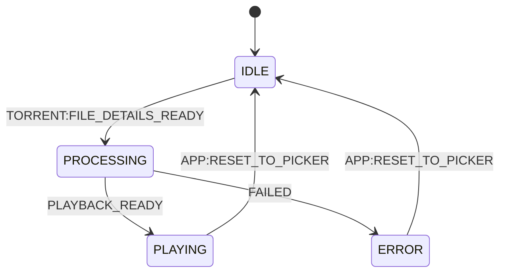
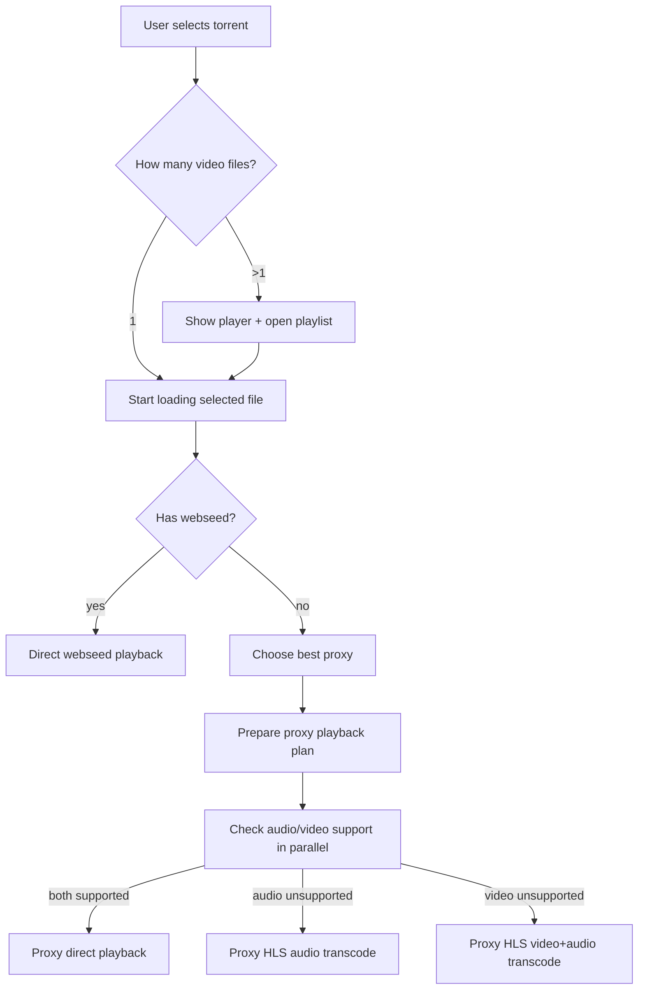

# torrent-online

Browser-based torrent video streaming. Drop a `.torrent` file, watch the video — no client install, no full download.

## What it does

1. You open the web UI and pick a `.torrent` file.
2. The browser parses the torrent's bencode metadata (name, files, trackers, webseeds).
3. The best available streaming source is selected and playback starts in the browser.

Three playback modes are supported depending on torrent source and codec support:

| Mode | When | How |
|------|------|-----|
| **Direct webseed** | Torrent has HTTP webseed URLs | `<video src="webseedUrl">` — no server involvement |
| **Proxy direct stream** | No webseed, proxy client registered, codecs are supported | Browser plays `/stream` URL from proxy |
| **Proxy HLS transcode** | Proxy required and at least one codec is unsupported | Proxy transcodes audio-only or video+audio and serves HLS; browser plays via hls.js |

When a torrent has multiple video files, player view opens with an empty video area and playlist open by default so user can select which file to start.

## Architecture

### Backend (`server.js` + `routes/`)

Minimal [Fastify](https://fastify.dev) server with one job: **proxy client registry**.

External torrent clients (proxy clients) register themselves via `POST /api/proxy-clients/register` and send periodic heartbeats. The server keeps them in an in-memory map and exposes the list via `GET /api/proxy-clients`. When a webseed is not available, the browser queries this list, scores the proxies by latency/load, and picks the best one to handle the torrent.

The server also serves the frontend as static files — no separate web server needed.

```
POST /api/proxy-clients/register   register a proxy client
POST /api/proxy-clients/heartbeat  keep-alive ping
GET  /api/proxy-clients            list registered proxies
GET  /health                       health check
GET  /healthz                      Kubernetes liveness probe
```

### Frontend (`public/`)

Pure ES Modules — no build step, no bundler.

#### Domain layer (`public/domain/`)

| File | Responsibility |
|------|----------------|
| `bencode.js` | Bencode encoder/decoder |
| `torrent-parser.js` | Parses `.torrent` binary into structured metadata |
| `webseed.js` | Builds playback URLs from webseed entries |
| `torrent-session.js` | Manages source registration on a proxy, caches keys, builds stream URLs |
| `hls-player.js` | Thin wrapper around hls.js for HLS playback |

#### Component layer (`public/components/`)

Components are **weakly coupled** — they never import each other. All cross-component communication goes through `document.dispatchEvent` / `document.addEventListener` with event names defined in `public/shared/events.js`.

| Component | Responsibility |
|-----------|----------------|
| `torrent-tv` | App orchestrator / FSM |
| `torrent` | File picker dialog, torrent parsing trigger |
| `loading` | Playback preparation: proxy selection, codec capability checks, direct/HLS start, progress and cancellation |
| `proxy-selector` | Probes registered proxies, scores by latency + metrics, picks the best |
| `player` | Video element wrapper and player-side playlist mode handling |
| `playlist` | Playlist list rendering and media-file selection events |
| `error` | Error display dialog |

#### Application FSM



See [`public/components/README.md`](public/components/README.md) for the full state diagram and coupling rules.

## Running

**Local:**
```bash
npm install
npm run dev    # with Node inspector attached
# or
npm start
```

Opens at `http://localhost:8080`. The server auto-discovers a free port starting from 8080 if that one is taken.

**Docker:**
```bash
docker build -t torrent-tv-server .
docker run -p 8080:8080 torrent-tv-server
```

**Production (via [torrent-tv/infra](https://github.com/torrent-tv/infra)):**

The server is deployed as part of the `infra` Docker Compose stack, behind nginx.
See the `infra` repo for full deploy instructions.

**Environment variables:**

| Variable | Default | Description |
|----------|---------|-------------|
| `PORT` | `8080` | Preferred server port |
| `NODE_ENV` | — | Set to `production` in the Docker image |

## Why these choices

- **Fastify** over Express: lower overhead, built-in schema validation, good async story.
- **No frontend build step**: the app is simple enough that native ES Modules work fine in modern browsers. Removing the build pipeline cuts tooling complexity to zero.
- **Event bus instead of component imports**: components can be developed, replaced, or removed independently without touching anything else. The FSM in `torrent-tv` is the only place that knows about the full application flow.
- **Strict event-only module communication**: components must not mutate each other's DOM directly; cross-component effects are expressed as shared events only.
- **In-memory proxy registry**: proxy clients are ephemeral; if the server restarts they re-register on the next heartbeat. No database needed.
- **Alpine Docker base**: keeps the image small (~40 MB) and reduces the attack surface.

## Playback Strategy



## License

This project is distributed as proprietary source-available software under [`LICENSE`](./LICENSE).

Code visibility in a public repository does not grant usage rights.
Commercial and production use requires a separate written commercial license.
Third-party dependencies keep their own licenses.
