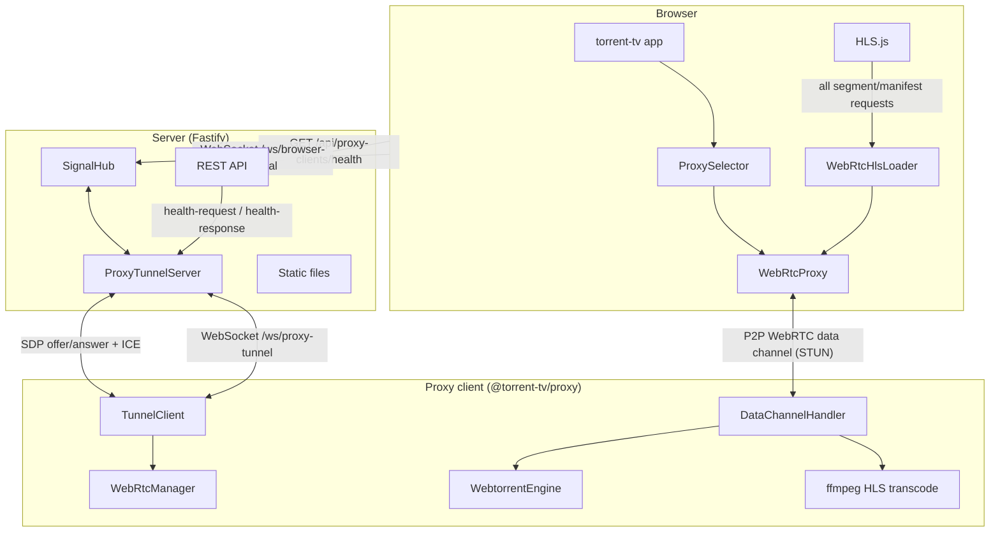
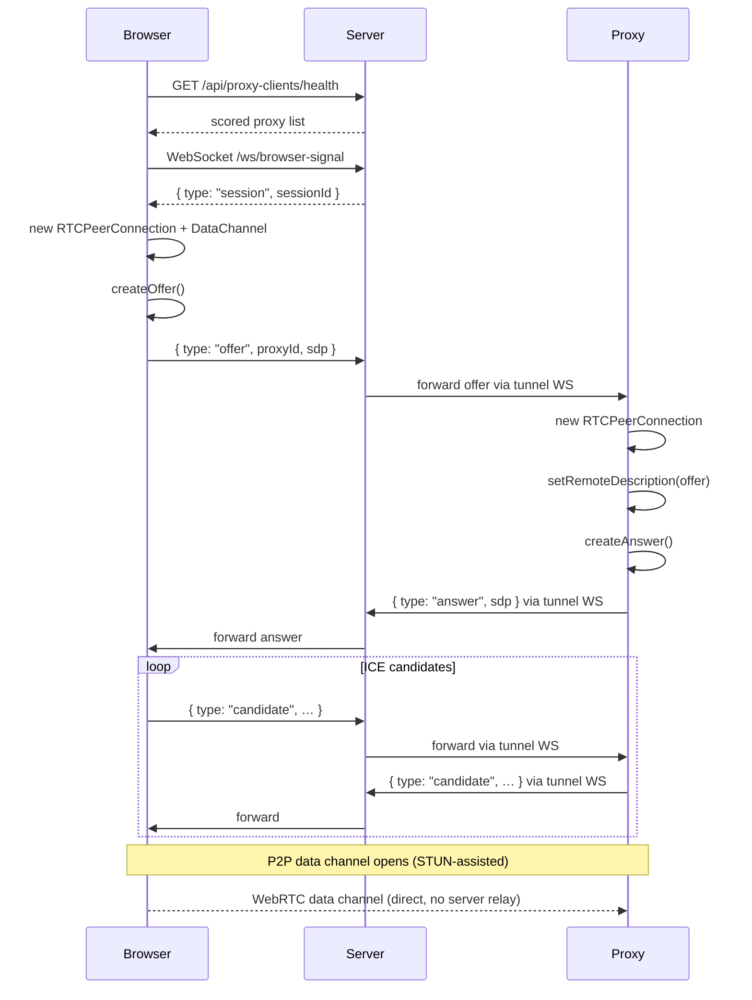
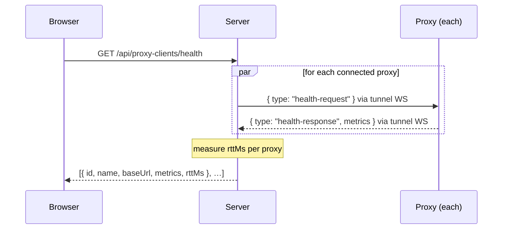
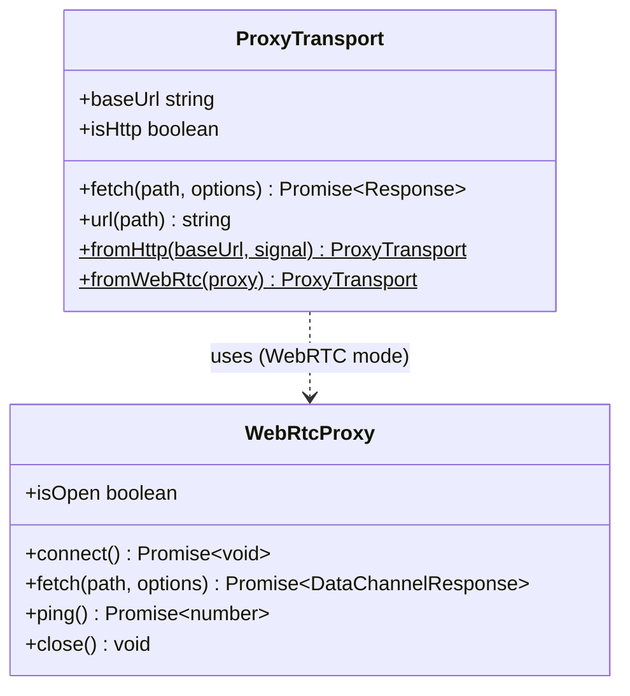
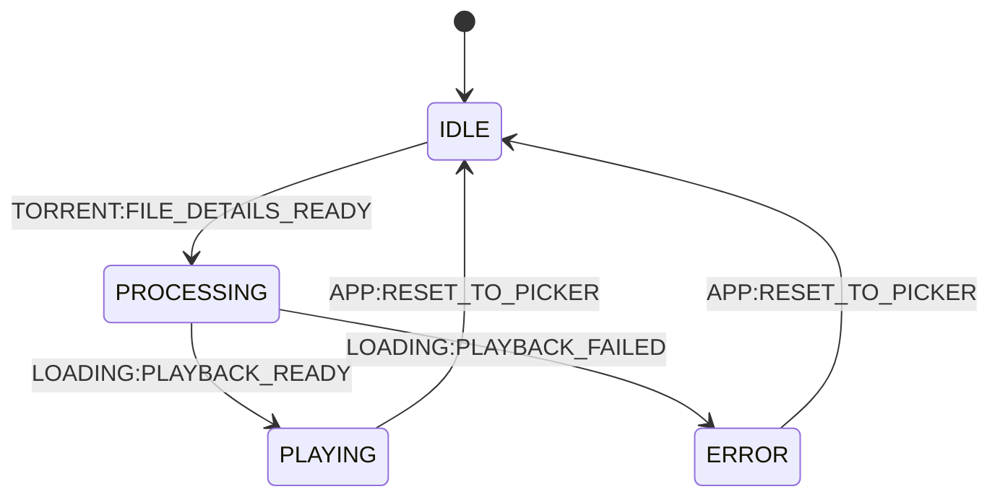
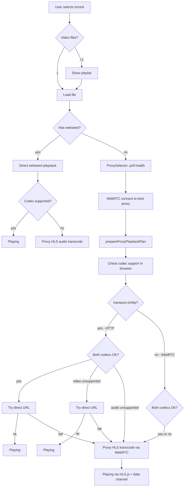
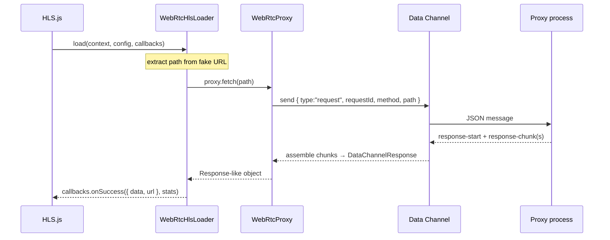

# torrent-online (server)

Browser-based torrent video streaming. Drop a `.torrent` file, watch the video — no client install, no full download.

## What it does

1. You open the web UI and pick a `.torrent` file.
2. The browser parses the torrent's bencode metadata (name, files, trackers, webseeds).
3. The best available streaming source is selected and playback starts in the browser.

Three playback modes are supported depending on the torrent source and codec support:

| Mode | When | How |
|------|------|-----|
| **Direct webseed** | Torrent has HTTP webseed URLs | `<video src="…">` — no server or proxy involvement |
| **WebRTC direct stream** | No webseed, proxy registered, codecs are browser-compatible | Browser ↔ proxy via WebRTC data channel → `/stream` |
| **WebRTC HLS transcode** | Proxy needed, ≥1 codec unsupported | Proxy transcodes to HLS; HLS.js fetches segments through data channel |

When a torrent has multiple video files, the player opens with the playlist panel so the user can select which file to play.

## System Architecture



## Backend (`server.js` + `routes/`)

Minimal [Fastify](https://fastify.dev) server. Its responsibilities are:

- **Proxy client registry** — proxies register and send heartbeats; the store tracks them.
- **Health aggregation** — on-demand health polling of all connected proxies via tunnel WebSockets, with RTT measurement.
- **WebRTC signalling hub** — forwards SDP offers/answers and ICE candidates between the browser and the selected proxy, enabling P2P data channel establishment.
- **Static file serving** — serves the frontend from `public/`.

### HTTP / WebSocket Routes

```
POST /api/proxy-clients/register      register a proxy client
GET  /api/proxy-clients               list all registered proxy clients
GET  /api/proxy-clients/health        poll health metrics from all connected proxies
GET  /ws/proxy-tunnel                 persistent WebSocket tunnel from proxy → server
GET  /ws/browser-signal               WebRTC signalling WebSocket for browser ↔ proxy P2P setup
GET  /health                          health check
GET  /healthz                         Kubernetes liveness probe
```

### Proxy Tunnel (`/ws/proxy-tunnel`)

Each proxy client opens one persistent WebSocket to this endpoint after starting. The server uses it for two purposes:

- **Health requests** — `GET /api/proxy-clients/health` sends a `health-request` message and awaits a `health-response` (timeout: 2 s).
- **WebRTC signal forwarding** — SDP offers from the browser are forwarded to the proxy; answers and ICE candidates from the proxy are forwarded back to the browser.

### WebRTC Signalling Flow



### Health Poll Flow



## Frontend (`public/`)

Pure ES Modules — no build step, no bundler.

### Domain Layer (`public/domain/`)

| File | Responsibility |
|------|----------------|
| `bencode.js` | Bencode encoder / decoder |
| `torrent-parser.js` | Parses `.torrent` binary into structured metadata |
| `webseed.js` | Builds playback URLs from webseed entries |
| `torrent-session.js` | Source registration on proxy, stream URL building, HLS session lifecycle |
| `proxy-transport.js` | Unified `fetch(path)` abstraction over HTTP or WebRTC data channel |
| `webrtc-proxy.js` | WebRTC peer connection + data channel to proxy (signalling, ping, fetch) |
| `webrtc-hls-loader.js` | Custom HLS.js loader class that routes all requests through the data channel |
| `hls-player.js` | Thin HLS.js wrapper; accepts optional custom loader for WebRTC transport |

### ProxyTransport abstraction

`ProxyTransport` hides whether the proxy is reached via HTTP or WebRTC. The rest of the application (including `TorrentSession`) always calls `transport.fetch(path, options)` and never constructs full URLs manually.



### Data Channel Wire Protocol

Every browser ↔ proxy exchange over the data channel uses JSON messages:

| Direction | Message type | Key fields |
|-----------|-------------|------------|
| Browser → Proxy | `request` | `requestId`, `method`, `path`, `query`, `headers`, `body` |
| Proxy → Browser | `response-start` | `requestId`, `status`, `headers` |
| Proxy → Browser | `response-chunk` | `requestId`, `data` (base64), `done` |
| Proxy → Browser | `response-error` | `requestId`, `error` |
| Browser → Proxy | `ping` | `id` |
| Proxy → Browser | `pong` | `id` |

### Component Layer (`public/components/`)

Components are **weakly coupled** — they never import each other. All cross-component communication uses `document.dispatchEvent` / `document.addEventListener` with event names from `public/shared/events.js`.

| Component | Responsibility |
|-----------|----------------|
| `torrent-tv` | App orchestrator / FSM |
| `torrent` | File picker, torrent parsing trigger |
| `loading` | Full playback pipeline: proxy selection, WebRTC setup, codec checks, direct or HLS start |
| `proxy-selector` | Polls `/api/proxy-clients/health`, scores proxies, connects WebRTC to the best one |
| `player` | Video element wrapper; playlist mode handling |
| `playlist` | Playlist rendering and media-file selection events |
| `error` | Error display dialog |

### Application FSM



### Playback Decision Flow



### WebRTC HLS Loader

When the proxy is reached via WebRTC, a custom `WebRtcHlsLoader` is created and passed to HLS.js. It intercepts every `load()` call for manifests and segments and routes them through `proxy.fetch()` instead of XHR/Fetch.



## Running

**Local:**
```bash
npm install
npm run dev    # with Node inspector attached
# or
npm start
```

Opens at `http://localhost:8080`. The server auto-discovers a free port starting from 8080 if that one is taken.

**Docker:**
```bash
docker build -t torrent-tv-server .
docker run -p 8080:8080 torrent-tv-server
```

**Environment variables:**

| Variable | Default | Description |
|----------|---------|-------------|
| `PORT` | `8080` | Preferred server port |
| `NODE_ENV` | — | Set to `production` in the Docker image |

## Design Notes

- **No build step for the frontend** — native ES Modules work fine in modern browsers. Zero tooling complexity.
- **Fastify** over Express — lower overhead, built-in schema validation, good async story.
- **Event bus instead of component imports** — components can be developed or replaced independently without touching other parts. The FSM in `torrent-tv` is the only place that knows about the full application flow.
- **In-memory proxy registry** — proxy clients are ephemeral; they re-register on the next heartbeat after a server restart. No database needed.
- **WebRTC instead of server-side relay** — once the P2P data channel is established, media data travels directly between the browser and the proxy. The server carries no streaming load.
- **Alpine Docker base** — keeps the image small (~40 MB) and reduces the attack surface.

## License

This project is distributed as proprietary source-available software under [`LICENSE`](./LICENSE).

Code visibility in a public repository does not grant usage rights.
Commercial and production use requires a separate written commercial license.
Third-party dependencies keep their own licenses.
