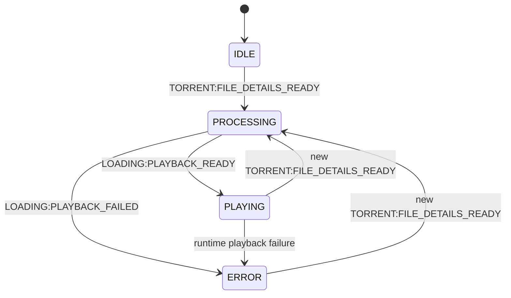

# Components System

This UI is designed as a set of weakly-coupled modules coordinated by events.

## Architecture

- Each component has its own folder and entry module.
- Components do not import each other.
- Cross-component interaction happens only through shared event constants from `public/shared/events.js`.
- `public/components/torrent-tv/torrent-tv.js` is the orchestration finite state machine (FSM) for app state transitions.
- `public/components/loading/loading.js` owns playback preparation (proxy selection, playback plan, direct/HLS start).
- `public/components/proxy-selector/proxy-selector.js` owns proxy probing, metrics analysis, and best-proxy selection.
- `public/components/playlist/playlist.js` owns playlist overlay rendering and file selection interactions.
- Shared cross-component contracts/state are in `public/shared`.
- Media/torrent domain logic is in `public/domain`.

## Event Bus

All communication uses `document.dispatchEvent(new CustomEvent(...))` and `document.addEventListener(...)`.

Event groups:

- `TORRENT_EVENTS`
- `LOADING_EVENTS`
- `ERROR_EVENTS`
- `PLAYER_EVENTS`
- `APP_EVENTS`

## Application FSM (Orchestrator)

## Module Coupling Rules

- Keep selectors/messages local to component classes.
- Keep event names centralized in `events.js`.
- Avoid direct DOM access in the orchestrator for component view nodes.
- Emit semantic events (`*_SHOW`, `FILE_DETAILS_READY`, `READY`, `PLAYBACK_*`) instead of calling component APIs directly.
- **Do not mutate other components' DOM nodes directly.** If a component needs another component to react (focus, mode, visibility, inert, etc.), emit a shared event and let the owner component handle its own DOM.
