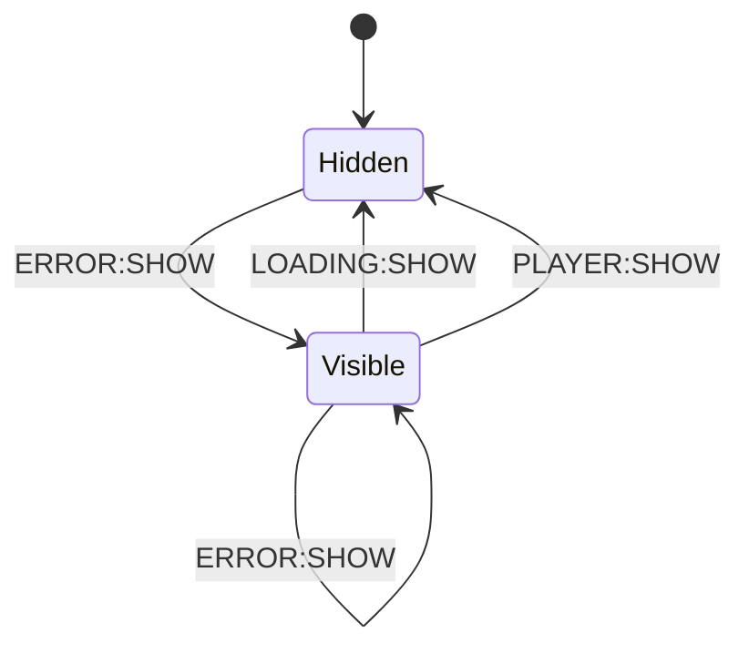

# Error Component

This component is the dedicated error presentation layer.

## Responsibilities

- Show error title and description on `ERROR:SHOW`.
- Hide itself on `LOADING:SHOW` and `PLAYER:SHOW`.
- Use native `<dialog>` modal behavior for visibility (`showModal` / `close`) with inert-safe toggling.

## State Machine

