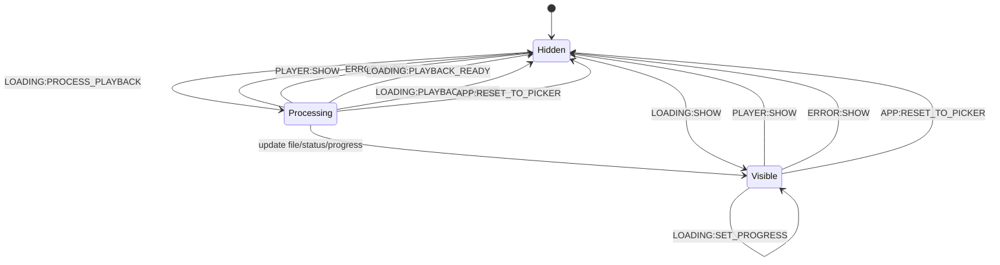

# Loading Component

This component renders processing progress while playback is being prepared and executes the preparation pipeline.

## Responsibilities

- Start playback pipeline on `LOADING:PROCESS_PLAYBACK`:
  - parse and normalize torrent payload,
  - if torrent has exactly one video file, start it automatically,
  - if torrent has multiple video files, show player and wait for playlist selection,
  - select the best proxy via `ProxySelector` when proxy path is required,
  - request proxy playback plan and check audio/video codec support in parallel,
  - start direct playback or HLS transcode (`audio-only` or `video+audio`).
- Handle `PLAYER:SELECT_MEDIA_FILE` to switch playback to a specific file index from playlist.
- Validate decoded video frames before reporting playback ready.
- Stop and release active playback/transcode sessions on reset, errors, and page close (`pagehide`/`beforeunload`).
- Show loading dialog and update UI with:
  - `LOADING:SET_FILE_NAME`
  - `LOADING:SET_STATUS`
  - `LOADING:SET_PROGRESS`
- Emit:
  - `LOADING:PLAYBACK_READY` when playback is ready,
  - `LOADING:PLAYBACK_FAILED` when preparation fails.
- Hide on `PLAYER:SHOW` or `ERROR:SHOW`.

## State Machine

