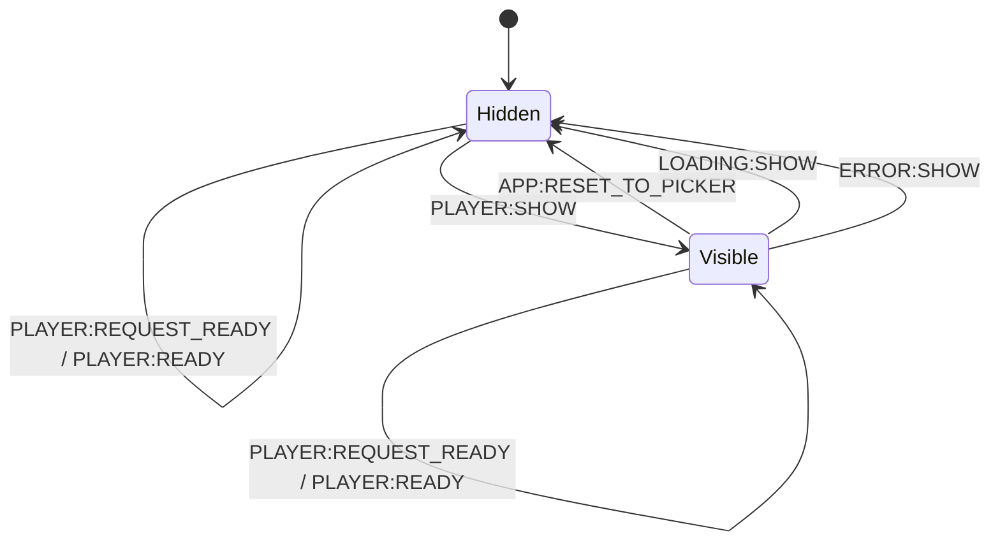

# Player Component

This component owns the visible video area, player menu controls, and player-side playlist mode behavior.

## Responsibilities

- Emit `PLAYER:READY` with `videoElement`.
- Show on `PLAYER:SHOW`.
- Hide on `LOADING:SHOW` and `ERROR:SHOW`.
- Re-emit `PLAYER:READY` on `PLAYER:REQUEST_READY`.
- Reset media element on `APP:RESET_TO_PICKER`.
- Stop and clear media element on `ERROR:SHOW`.
- Handle playlist mode events:
  - `PLAYER:OPEN_PLAYLIST` -> force playlist-open visual state, set expanded state, make video inert.
  - `PLAYER:CLOSE_PLAYLIST` -> clear expanded/playlist mode.
  - `PLAYER:FOCUS_PLAYLIST_TOGGLE` -> move focus to playlist toggle.
- Emit:
  - `PLAYER:OPEN_PLAYLIST` / `PLAYER:CLOSE_PLAYLIST` from playlist toggle button.
  - `APP:RESET_TO_PICKER` from reset button.

## State Machine

