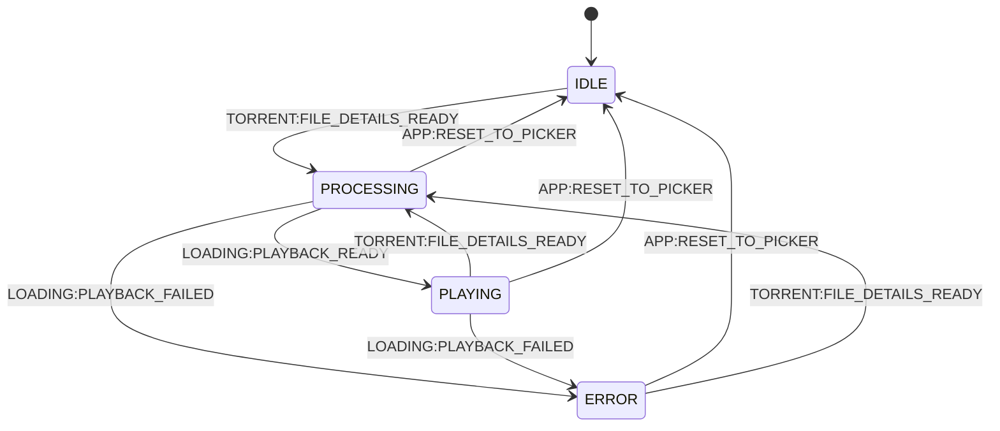

# App Orchestrator Component

This component owns the application FSM and coordinates the high-level flow.

## Responsibilities

- Listen for `TORRENT:FILE_DETAILS_READY` and start processing by emitting `LOADING:PROCESS_PLAYBACK`.
- Track FSM transitions (`IDLE`, `PROCESSING`, `PLAYING`, `ERROR`).
- React to loading outcomes:
  - `LOADING:PLAYBACK_READY` -> show player.
  - `LOADING:PLAYBACK_FAILED` -> show error.
- Handle `APP:RESET_TO_PICKER` by returning FSM to `IDLE`.
- Keep orchestration event-only; this module must not mutate view DOM directly.

## State Machine

