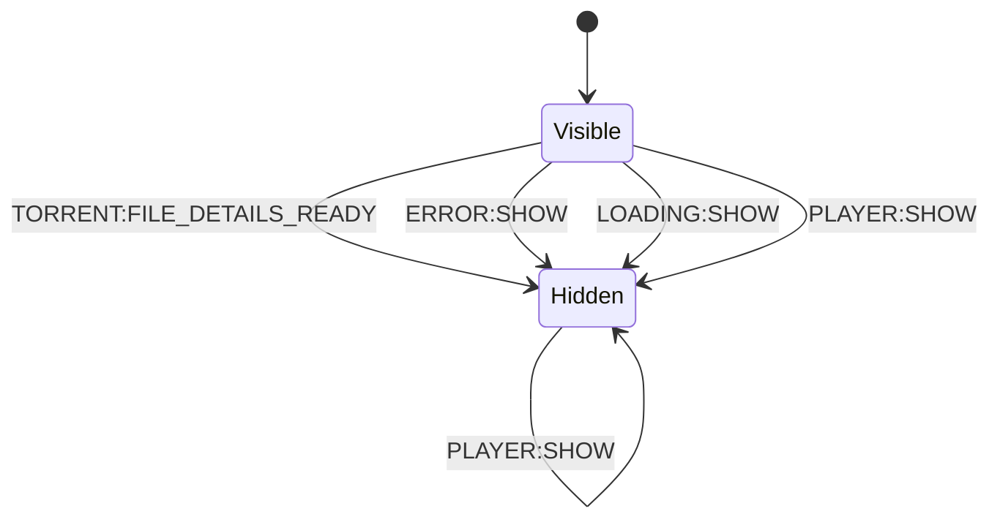

# Torrent Component

This component owns the torrent file input dialog.

## Responsibilities

- Accept only `.torrent` files.
- Accept file input from:
  - file picker
  - drag-and-drop anywhere on the page
  - paste from clipboard
- Handle drag-and-drop/paste only while the torrent picker view is open.
- Parse the selected torrent and extract media file groups:
  - video
  - audio
  - subtitles
- Emit `TORRENT:FILE_DETAILS_READY` with parsed torrent details and media groups.
- Emit `ERROR:SHOW` when no valid torrent file is selected.
- Hide on `LOADING:SHOW`, `PLAYER:SHOW`, and `ERROR:SHOW`.
- Show by default on app start and on `APP:RESET_TO_PICKER`.

## State Machine

